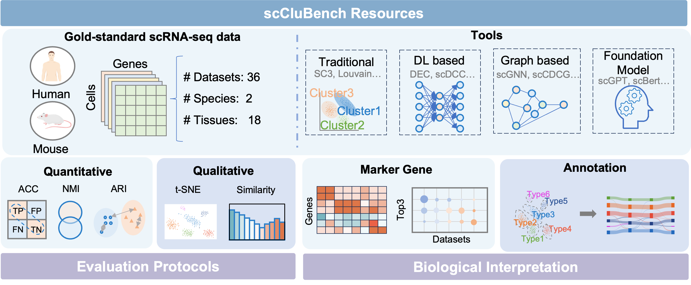

# scCluBench: Comprehensive Benchmarking of Clustering Algorithms for Single-Cell RNA-seq
[](https://arxiv.org/pdf/2509.25884.pdf)

A standardized, end-to-end benchmarking framework for evaluating single-cell RNA sequencing (scRNA-seq) clustering methods with curated datasets, unified protocols, and reproducible biological interpretation pipelines.

> Paper: **scCluBench: Comprehensive Benchmarking of Clustering Algorithms for Single-Cell RNA Sequencing** (AAAI 2026)  
> This repository provides datasets, implementations/wrappers, evaluation, and analysis scripts to reproduce the benchmark.

---

## Highlights

- **Curated benchmark datasets**: 36 scRNA-seq datasets from **human and mouse**, covering **18 tissue types**, multiple sequencing technologies, and diverse data scales/sparsity.  
- **Broad method coverage**: Traditional, deep learning-based, graph-based, and biological foundation models in one unified benchmark.
- **Unified evaluation protocols**:
  - Quantitative: **ACC / NMI / ARI**
  - Qualitative: **t-SNE visualization** and **representation similarity** analysis
- **Standardized biological interpretation**:
  - Marker gene identification (DEGs)
  - Cell type annotation (best-mapping vs marker-overlap) + Sankey-based comparison
- **Reproducible workflow** with standardized I/O formats and modular code structure.

---

## Framework

<p align="center">
  
</p>

**Figure**: Overview of the scCluBench benchmarking framework. The pipeline includes: (1) curated scRNA-seq datasets, (2) unified preprocessing, (3) clustering methods from multiple categories (traditional, deep learning, GNN, foundation models), (4) comprehensive evaluation metrics, and (5) biological interpretation.

---

## Benchmarked Models

All models have been unified with a standard interface for easy benchmarking:

```bash
python run.py --data_path /path/to/data.h5ad --n_clusters 10 --save_dir ./results
```

### Deep Learning Methods

| Model | Description | Framework | Reference |
|-------|-------------|-----------|-----------|
| **scDeepCluster** | Deep embedding clustering with ZINB loss | PyTorch | Tian et al., 2019 |
| **scDCC** | Deep count autoencoder with clustering | PyTorch | Tian et al., 2021 |
| **scMAE** | Masked autoencoder for single-cell | PyTorch | - |
| **scNAME** | Neighborhood aggregation for masked embedding | PyTorch | Wan et al., 2022 |
| **scziDesk** | Zero-inflated deep embedding for single-cell | TensorFlow | Chen et al., 2020 |
| **DESC** | Deep embedded single-cell clustering | TensorFlow | Li et al., 2020 |
| **DEC** | Deep embedded clustering | PyTorch | Xie et al., 2016 |

### Graph Neural Network Methods

| Model | Description | Framework | Reference |
|-------|-------------|-----------|-----------|
| **scGNN** | Graph neural network for scRNA-seq | PyTorch | Wang et al., 2021 |
| **scDSC** | Structural deep clustering network | PyTorch | Bo et al., 2020 |
| **scCDCG** | Cell-type discovery via clustering on graphs | PyTorch | - |
| **AttentionAE-sc** | Attention-based autoencoder for single-cell | PyTorch | - |

### Foundation Models

| Model | Description | Reference |
|-------|-------------|-----------|
| **scGPT** | Single-cell GPT for cell type annotation | Cui et al., 2024 |
| **Geneformer** | Transformer model for single-cell biology | Theodoris et al., 2023 |
| **GeneCompass** | Foundation model for single-cell analysis | Yang et al., 2023 |

---

## Project Structure

```
scBench/
├── DeepLearning/           # Deep learning-based methods
│   ├── scDeepCluster/
│   ├── scDCC/
│   ├── scMAE/
│   ├── scNAME/
│   ├── scziDesk/
│   ├── desc/
│   └── dec/
├── GNN/                    # Graph neural network methods
│   ├── scGNN/
│   ├── scDSC/
│   ├── scCDCG/
│   └── AttentionAE-sc/
├── Foundation/             # Foundation models
├── preprocess.py           # Unified data preprocessing
├── evaluation.py           # Evaluation metrics (ACC, NMI, ARI, etc.)
└── utils.py                # Utility functions for saving results
```

---

## Quick Start

### Installation

```bash
# Clone the repository
git clone https://github.com/your-repo/scBench.git
cd scBench

# Install dependencies
pip install -r requirements.txt
```

### Run a Model

```bash
# Example: Run scDeepCluster
python DeepLearning/scDeepCluster/run.py \
    --data_path data/example.h5ad \
    --n_clusters 10 \
    --save_dir results/scDeepCluster

# Example: Run scGNN
python GNN/scGNN/run.py \
    --data_path data/example.h5ad \
    --n_clusters 10 \
    --save_dir results/scGNN
```

### Output Format

All models save results in a unified format:
- `embedding.npy`: Latent representations (n_cells x n_dims)
- `pred.npy`: Cluster predictions
- `metrics.json`: Evaluation metrics (ACC, NMI, ARI, F1-macro, FMI, V-measure, Homogeneity, Completeness)

---

## Evaluation Metrics

| Metric | Description |
|--------|-------------|
| **ACC** | Clustering accuracy (with Hungarian matching) |
| **NMI** | Normalized mutual information |
| **ARI** | Adjusted Rand index |
| **F1-macro** | Macro-averaged F1 score |
| **FMI** | Fowlkes-Mallows index |
| **V-measure** | Harmonic mean of homogeneity and completeness |
| **Homogeneity** | Each cluster contains only members of a single class |
| **Completeness** | All members of a given class are assigned to the same cluster |

---

## Citation
```bibtex
@article{xu2025scunified,
  title={scUnified: An AI-Ready Standardized Resource for Single-Cell RNA Sequencing Analysis},
  author={Xu, Ping and Wang, Zaitian and Wang, Zhirui and Li, Pengjiang and Zhang, Ran and Li, Gaoyang and Xie, Hanyu and Wang, Jiajia and Zhou, Yuanchun and Wang, Pengfei},
  journal={arXiv preprint arXiv:2509.25884},
  year={2025}
}
```
